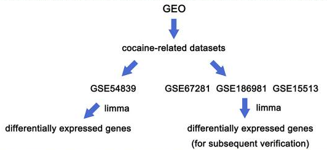
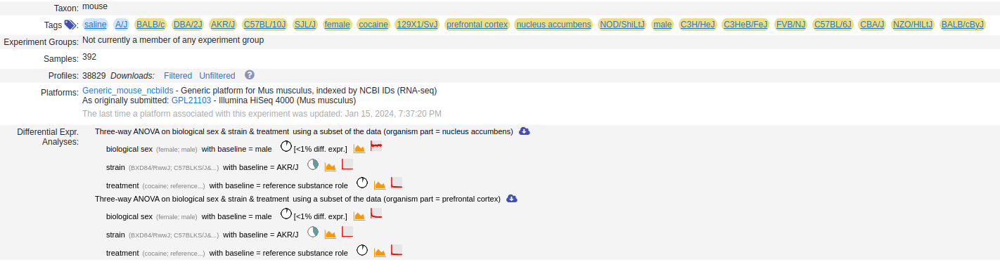
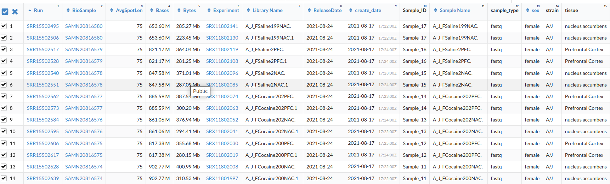
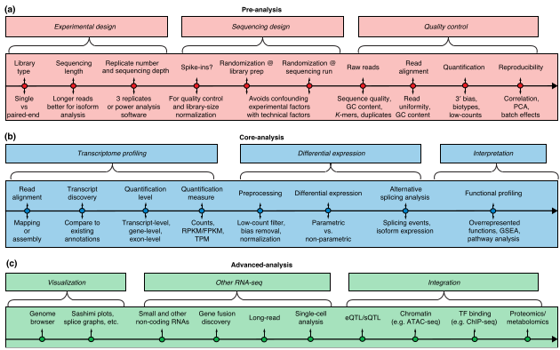
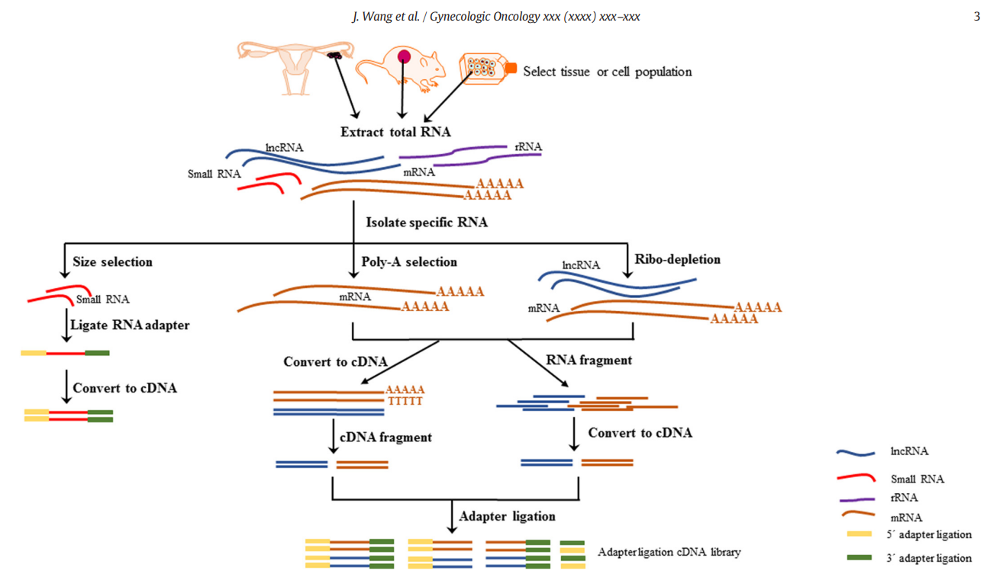
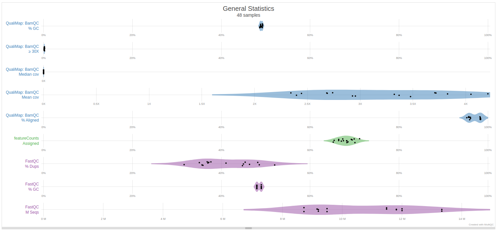
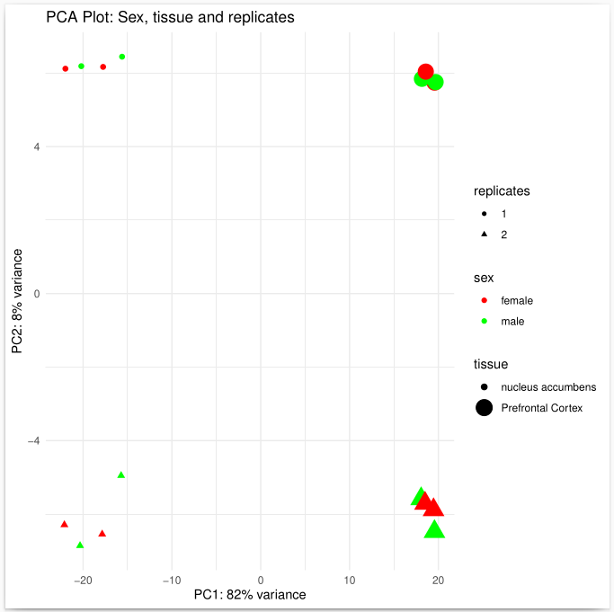
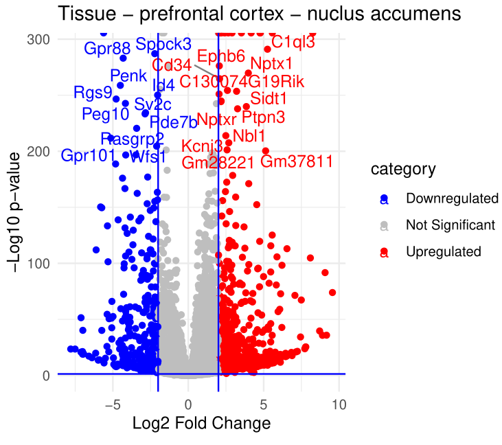
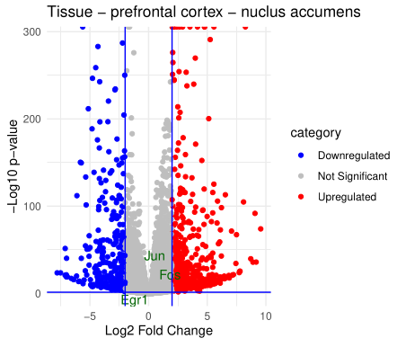

# *Identification of key genes for cocaine addiction using integerated bioinformatics analysis*

# Compiled by Desmond Akabetso Nde

# Last updated on the 10 of September 2024

# Enjoy reading through and do not hesitate to comment your thougths on my approach and analysis.

[Wang X et al](https://www.ncbi.nlm.nih.gov/pmc/articles/PMC10352680/) proposed a study to reveal the mechanism of cocaine addiction and identification of key genes that play important roles in cocaine addiction.

In their study, they identified four key genes (JUN, FOS, EGR1 and IL6) that might serve as biomarkers of cocaine addiction. They used publicly available data from the Gene Expression Omnibus (GEO) with the experimental dataset [GSE54839](https://www.ncbi.nlm.nih.gov/geo/query/acc.cgi?acc=GSE54839) containing 10 samples of cocaine treated with three replicates each and 10 samples of contol with three replicates each. They further used other dataset as veryfication for their results as shown in the figure below.

## Aim of this study

In this study, we aim to replicate results from Wang et al, we choosed to use a different approach. They developed their eperimental dataset to confirm with verification dataset, we developed their verification dataset and compared with their experimental dataset. our experimental dataset which is their verification dataset [GSE186981](https://www.ncbi.nlm.nih.gov/geo/query/acc.cgi?acc=GSE186981) is an RNA-Seq data in HMDP mouse strains of nucleus accumbens and prefrontal cortex brain regions. it contains 392 samples accross different strains between mail and female. Below is the dataset overview from [GEMMA](https://gemma.msl.ubc.ca/expressionExperiment/showExpressionExperiment.html?id=21038)

In this dataset, due to it's large size, we only consedered one strain A/J, below is the snipset overview of the selected strains. dataset contains 16 runs and 8 biosamples treated with saline and cocaine. Each sample has two replicates.

## Workflow

The roadmap used for this work is described by [Conesa A et al](https://pubmed.ncbi.nlm.nih.gov/26813401/) with (a) containing the eperimental design, sequencing and quality contol, (b) the transcriptome profiling, differential gene expresion and functional profiling. (c) while there migty be post differential expression analysis methods, it's is not expressed in this study.

1. Pre-analysis
	- **Library preparation**
	- **Quality control**
2. Core-analysis
	- **Transcriptome profiling:** alignment, quality control, Quantification
	- **Differential expression**
	- **Interpretation**
	
### Preanlysis

According [Conesa A et al](https://pubmed.ncbi.nlm.nih.gov/26813401/), the first important step in RNA_seq study is to first choosing an appropriate library type, sequencing depth and number of replicates for the biological system under study. To provide you with a brief rundown of library preparation from the perspective of [Wang J et](https://pubmed.ncbi.nlm.nih.gov/30297273/) in a similar case with cancer cells. First the RNA is extracted from the cells and the subsets or RNA molecules are isolated. mRNA are mostly extracted using poly-A selection to prevent degration of mRNA. small RNAs lacking poly-A tail can be selected using size selection. the process is briefed in the diagram below.

They further proposed a post library preparation workflow. Millions of short reads sequenced from PCR amplified of cDNA adapter ligaged fragments (reasons why it's important to check adapters and trim). Reads can be derived from single-end or paired end sequencing which can then be aligned to reference genome followed by down streams analysis. see the diagram below for clarity.

### Library preparation

As mentioned earlier, the said dataset was downloaded from GEO using the SRA_ACC_list and the preftech linux command line tool. later the data was unziped and dumped to fasq using the fastq-dump with the --split-files option for processing paired reads. 

### Quality control

As described by [Guo Y et al](https://academic.oup.com/bib/article/15/6/879/180439), Quality control is essential at three different stages: Raw data quality conrol, alignment quality conrol and variant calling quality control.

FastQC was used to study the quality control of the raw data, the quality showed less than o.1% of adapter contamination and phred score > 30. we saw minimal reason to trim the data and proceeded directly with alignment using HISAT2. After alignment, Qualimap was used to look into the alignment coverage and the overal quality of the data at this stage. multiQC was used to generate i nice report of the entire quality control. a snipset of the general statistics is shown below. The mm10 reference genome had been previously downloaded and indexed with HISAT2 for HISAT2 alignment.

Here, we have a nice view of the general quality statistics. the alignment coverage, we observed that only a small portion of the genome is covered by our sequencing reads. but this is okay because we are not performing a whole genome sequence. 

We also see that, the QC content for Qualimap et fastQC are the same confirming minimal errors during alignment with GC alignment content > 95%.

The futureCounts of allignment that were qauntified and assigned were between 65% to 70%. FastQC showed a duplication reads rate of 40% averaged which impacts the unassigned reads.

Overal from the statistics table, there are 16 samples not 48. 48 represents the sum of the samples in each case (Bam, fastqc and featurecounts).

### Transcriptome profiling

featureCounts was used to quantify the genes expression, the experimental metadata was also downloaded from the same website as the dataset and cleaned in python contain gene names and design factors needed for downstream analysis. featureCounts results were equally cleaned in python to match the sample names in the metada.

### Differential gene expression

Deseq2 was used to differntially expressed the reads. design factors was parsed to treat the sample factors independently. 

### Intepretation

Log2 fold change set to 2 and p-value set to 0.05 following the articles mentioned in this study. ALthough Wang X et al used a Log2FC of 1 in their experimental dataset.

Firstly, a histogram of p-values and adjusted p-values was ploted to check the true hypothesis. We saw that thre was a larger fraction of reads with less than 0.05 pvalue, the adjusted pvalue show a rather smaller fraction of reads lesser than 0.05 which is great showing that the significant reads are truely biologically relevant.

Next we ploted the dispersion plot to check the variability of gene expression.  The fitted and shrunk dispersion demonstrate that the statistical model effectively accounts for reliable detection of differentially expressed genes. Generally, genes with low expression levels have high variability.

Deseq output plots can be seen in [featureCounts](https://github.com/akabetso/Cocaine-addiction-RNA-seq/tree/master/results/featureCounts)

PCA plot showed an 8% variability between replicates as well as male and female. for replicates it is always impeccable when it's variability is very small showing consistency and replicability. However 8% is quite a number showing a small percentage of variability but minimal which is within considerable limits. There was an important variability between the tissue types, Biologically, tissues from the nucleus accumbens respond differently to tissues from the prefrontal cortex when treated with cocaine. The doses where not considered for simplicity. But what about cocaine vs control!

Volcano plot observations supported the observations described by the PCA above. There were highly significantly differentiated genes between the nucleus accumbens and prefrontal cortex and minimal accroos other design factors. This shows men and women will experience similar reactions when exposed to cocaine drugs, but in terms of Saline control and cocaine drugs, there were fewer upregulated and downregulated showing the cocaine and saline have the same effect in A/J mouse strain, There were fewer reads in general as even the insignificant reads were fewer. I will further investigate this but possibility being i might have wrongly intepreted the control and treatment samples. 

 

The final step was finding the significant genes to compare with that of Wang X et al. We download a file containing all the gene id, and gene names of the mm10 model, and creating a correspondance in R to label the highly significant gene names on the volacon plot as shown above. Here we did not see the any of the genes mentioned by Wang et al to be highly significant though the genes are present in our sample, significant but not highly signifcan. This is okay as we only used a subsample of one strain amongs the many strains of the available data. 

We showed the presence of the genes mentioned by Wang X et al in the A/J strains, but suggest that in this strain, there are more highly significan genes than those they mentioned suggesting different genes are involve or respond to cocaine drug in A/J mouse strain than in humans. Drugs for cocaine addition developed based on their predicted genes might not be effective for A/J mouse strain since different genes are involve and the mechanism fo action might be different.

 

The figure above clearly shows the expression level of the genes identified by Wang X et al to be involved in cocaine addiction mechanisnm. In our case, this genes are not significant, however, if we changed the log2FC to 1 as in thier case, JUN and FOS genes will be upregulated genes. Their results were supported by performing literature review of a network of protein protein interactions which revealed these genes only are key genes involve in cocaine addiction mechanism.

Thank you for reading through, please do not hesitate to comment your thoughts on my presentation and approach on this work. 
